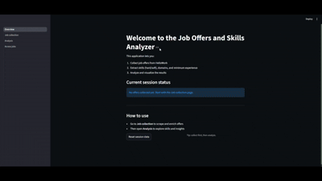

# AI Offers Analytics with a Secure VPN-Based Architecture

This project provides a secure job-offer scraping and analytics pipeline, where all outbound traffic is routed through a VPN tunnel using Gluetun with ProtonVPN (WireGuard).

A Streamlit application is included to scrape, visualize, and analyze extracted job offers using AI-powered techniques.

The architecture guarantees that no network traffic can bypass the VPN, thanks to Gluetun’s built-in firewall and kill-switch mechanisms.

---

## 🏗️ Architecture

### Services

- **gluetun**  
  VPN gateway based on WireGuard (ProtonVPN) providing a firewall, kill switch, and DNS leak protection.

- **Streamlit App**  
  Web-based interface used to **scrape, visualize, and analyze job offers in France only**.  
  The application generates interactive dashboards and insights on:
  - Hard skills  
  - Soft skills  
  - Required experience  
  - Geographic distribution (cities)

  The app shares Gluetun’s network stack to ensure that **all outgoing HTTP requests are routed through the VPN**, guaranteeing anonymity and network isolation:

  ```yaml
  network_mode: service:gluetun
  ```

## Project structure
```
├── docker-compose.yml          # Orchestrates Gluetun + Streamlit services
├── .env                        # Global environment variables (VPN, API keys) ###### Important to create ######
├── Proton_vpn.png              # ProtonVPN setup illustration
├── ReadMe.md                   # Project documentation
├── streamlit/                  # Streamlit application (multipage)
│   ├── Dockerfile              # Streamlit container image
│   ├── requirements.txt        # Python dependencies for Streamlit app
│   ├── .env                    # Streamlit-specific environment variables ###### Important to create ######
│   └── app/
│       ├── app_streamlit.py    # Main Streamlit entry point
│       ├── Overview.py         # Overview / dashboard page
│       ├── Job_collection.py   # Job scraping & collection page
│       ├── Analysis.py         # Skills & experience analytics
│       ├── access_jobs.py      # Job access & filtering page

```


## Quick start
1. Create a Free protonvpn account ([link](https://protonvpn.com/fr/l/vpn-home-free?url_id=397&utm_campaign=ww-all-2c-vpn-gro_aff-g_acq-partners_program&utm_source=aid-tune-1725&utm_medium=link&utm_term=vpn_home_free_landing&utm_content=26&phfp=false)) then get your ProtonVPN/Wireguard credentials. 
2. Create an API key on Google Generative AI.
2. Create `.env` and configure your ProtonVPN/Wireguard credentials.

.env example :
```
# Config de base
TZ=Australia/Brisbane

# Config OpenVPN
OPENVPN_USER=****
OPENVPN_PASSWORD=****

# Config WireGuard
WIREGUARD_PRIVATE_KEY=****

# Google API Key gen ai
GENAI_API_KEY=****
```
4. Start the services

Run the following command in your terminal:

```bash
docker compose up -d
```
5. You can run the web app locally on *http://localhost:8501/*

## Video of the result



[▶️ Watch full video](Video.mp4)


Notes:
- This project is for educational and research purposes only.